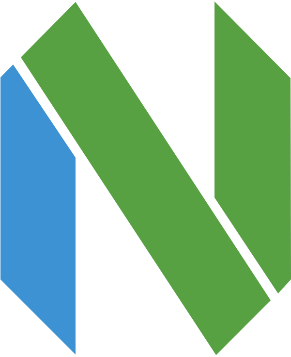
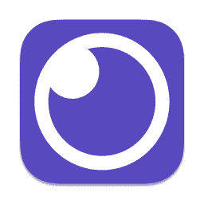
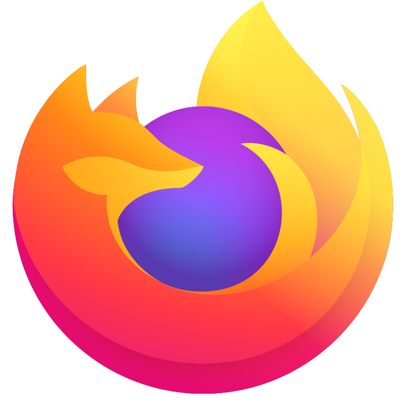
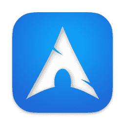
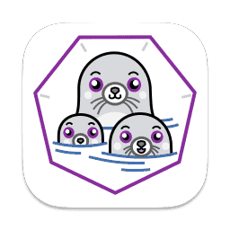
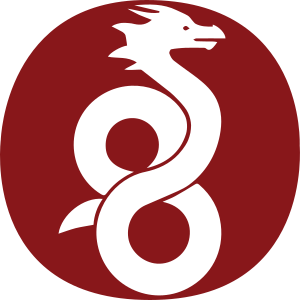

### Hey,
- 👤 I am an enthusiast and self-taught about all things Linux, I love open source projects, keeping up to date and trying new things;
- 🎓 I am currently a student;
- 💬 Langs: Portuguese (native), English (learning);
- 🌍 Timezone: Europe/Lisbon;
- 😄 Pronouns: he/him

## Programing Languages:

## Desktop Apps/Utils

    
    
    
    
    
    
    

## [🐧] Linux Distributions I love for:
### Desktop/Laptop and Server

    
    
    
    

### Desktop/Laptop only

    
    

## Databases

## Cloud computing

     and On-premises.

## Containers

<a href=”https://www.ovhcloud.com/pt/”>
    
<a/>

## Networking

    
    

