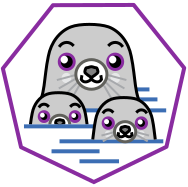

### Hi there 👋
- 👤 I am enthusiastic and self-taught about all things Linux, I love open source projects and learning about new technologies.
- 🎓 I am currently a student
- 🌱 I am currently learning Nix, Java, HTML and CSS
- 💬 Langs: Portuguese (native), English (learning)
- 🌍 Timezone: Europe/Lisbon;
- 😄 Pronouns: he/him

### [🐱]-Github Stats

  

  
### [🔨]-Languages and Tools:

  <code></code>

  <code><a href="https://github.com/" target="_blank"> </code>

### [🐧]-Distros that I love:

  
  <code>
  </code>

